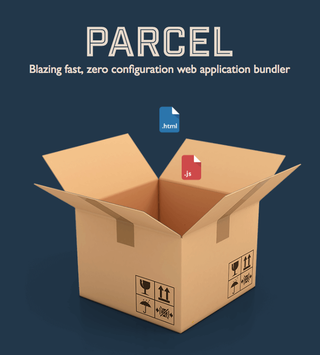
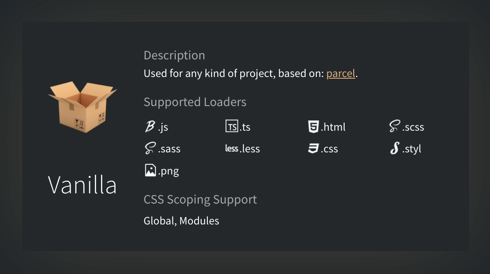

From day one [we](https://codesandbox.io)'ve always tied templates to a CLI. The
main reason for this is that we want to keep sandboxes simple, you shouldn't
need to do any configuration to get started. I didn't want to create a
'`Vanilla`' template because there was no way to create 'vanilla' web projects
without configuration, until recently.

## Parcel



A new bundler called '[Parcel](https://github.com/parcel-bundler/parcel)' was
released in December by [Devon Govett](https://twitter.com/devongovett). Parcel
is a web application bundler that values zero configuration. They reuse classic
web concepts, like using `index.html` as the entry point of the application,
which makes it really easy and intuitive to get started with a new project. You
only have to create an `index.html` and run `parcel index.html` to get a working
application. They automatically detect what kind of web application you're
running, and adapt the configuration to that if it's not specifically set.

This is aligns perfectly with the values of CodeSandbox. There is almost no
friction to get started, and all the needed configuration is automatically
detected & installed. That's why I decided to **finally** build a Vanilla
template and use Parcel as our configuration behind it.

## Vanilla Template



We have a new sandbox called `vanilla`, unlike other sandboxes, this sandbox has
`index.html` as its entry. From this `index.html` you can add `script` and
`link` tags to other files and they will be added to the bundle. We support all
loaders that Parcel supports, so we support:

- [Babel](https://github.com/babel/babel)
- [TypeScript](https://github.com/Microsoft/TypeScript)
- [SCSS/Sass](https://github.com/sass/sass)
- [LESS](https://github.com/less/less.js)
- [Stylus](https://github.com/stylus/stylus)
- [CSS Modules](https://github.com/css-modules/css-modules)

We also recognize the difference between:

```js
import styles from './styles.css';
```

and

```js
import './styles.css';
```

In the first code block we will generate CSS modules from the CSS file, and in
the second block we won't.

You can try it out here:

<!-- https://vanilla.codesandbox.io -->

https://codesandbox.io/s/vanilla?fontsize=14&view=split

#### Configuration

Like Parcel, we automatically do configuration for you. We automatically detect
if you're using [React](https://github.com/facebook/react) or
[Preact](https://github.com/preactjs/preact) and will adjust our Babel
configuration for it. We do support Babel/TypeScript configuration, so you can
also choose to do your own configuration by creating a `tsconfig.json` or a
`.babelrc`.

#### GitHub, Zip Extraction & Deployment Integration

Like the other templates, you can create repos, make commits and PRs, download
and deploy sandboxes using this template. Without leaving the browser.

## Beta Warning

This is our first template that uses HTML as an entry point, so there can be
bugs or unintended behaviour that still needs to be solved. Please
[let us know in the repo](https://github.com/codesandbox/codesandbox-client/issues/new/choose)
if you find any issues!

## Thanks

I want to thank [Devon Govett](https://twitter.com/devongovett) for building
this beautiful bundler, I was able to effortlessly build an application in it.
Great work!

If you like what we're doing, consider becoming a
[contributor](https://github.com/codesandbox/codesandbox-client) or a
[patron](http://codesandbox.io/patron)! You can stay up to date with CodeSandbox
news either on [@CompuIves](https://twitter.com/CompuIves) or
[@codesandbox](https://twitter.com/codesandbox).
