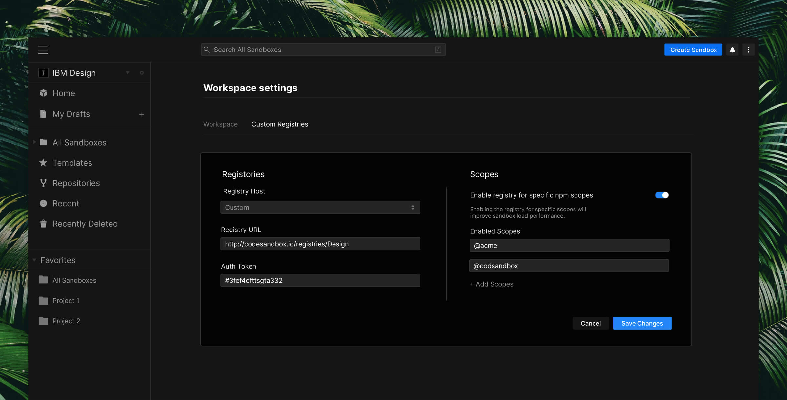
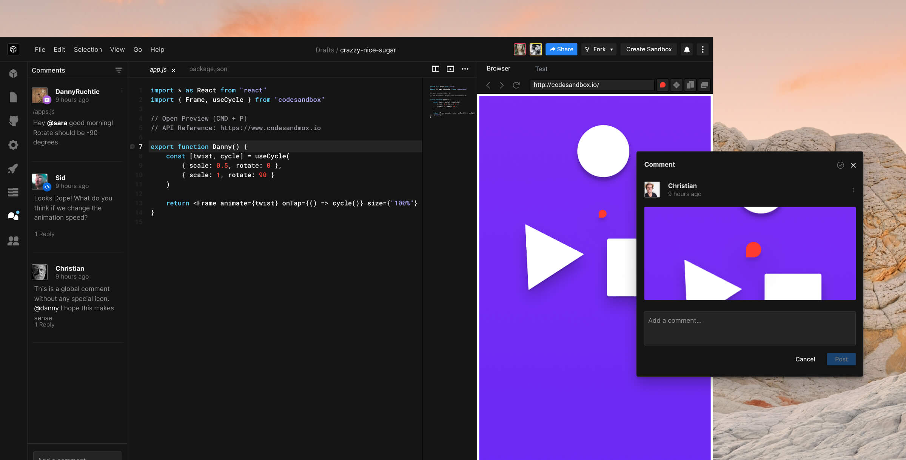

CodeSandbox is known for its instant sandboxes for rapid web development, which
millions of developers now use to prototype ideas and experiment with code
quickly. But its real superpower emerges when you use it to collaborate, as that
impact on development velocity is then multiplied throughout your team.

This is why we’re so excited to announce Team Pro. Team Pro is the best way to
use CodeSandbox with a group. It’s not just for developers—you can bring
designers, product managers, QA, and other stakeholders into your development
process. Team Pro is purpose-built for product teams of all sizes to prototype
rapidly, share knowledge, and get better feedback so you can all build faster,
together.

https://youtu.be/5AWGpS0Npzk

## Code Collaboration Made Easy

For many of us, our lives are now inextricably woven into the cloud. Especially
at work, a growing number of collaboration tools help us create documents,
communicate, and even design products together. So it’s interesting then that
software development has lagged in this trend. For many, a local development
environment is still their happy place. When building for yourself, it feels
fast—customized to your needs, and optimized for pushing code to production.
It’s what you’re used to and where you feel most productive. The growing problem
here, though, is that modern web development is inherently collaborative, and
local development environments can be a barrier to working together effectively.

When you come together, you feel bogged down. Prototyping something new is a
jumble of tickets, meetings, mockups, and screenshots. It’s challenging to share
running code with developers and even harder with other teams because
environments and tooling limit access. Iterating can be slow as you wait on
builds and deploys before others can see your changes. Meanwhile, getting
feedback is fragmented and confusing. Comments and screenshots come in from all
over the place—DMs on Slack, in emails, Google docs, and issues. Then when you
come to action it, you need a reproduction. Queue the back and forth to
understand the steps, get the browser version, resolution, etc.

These bottlenecks sap our creativity. So, in the end, we don’t try out ideas—the
collaboration overhead is simply too much. We don’t learn from each other as the
difficulty in collaborating means we don’t seek help as readily as we should
either. As a team, this impacts our velocity with a compounding effect: instead
of testing ideas, we take risky bets on unvalidated assumptions, and we don’t
iterate because sharing and getting feedback is such a slog.

We created Team Pro to remove these bottlenecks by using CodeSandbox at work
with your entire product team. At the core is a shared workspace for your code,
apps, and templates so that everyone can work on sandboxes together. Then we’ve
built specific features to really get you all building faster together.

## Prototype Rapidly with Private NPM Packages

Being able to utilize the 1M+ public packages on npm provides a huge
productivity boost. Using private packages can be similarly transformative,
saving you from reinventing the wheel each time you prototype something new.
With custom registry support, you can retrieve npm packages from your own
registry, whether that’s GitHub, another cloud-hosted option, or even
self-hosted and behind a VPN. This means you can now hook into your component
library or design system and utilize your own private packages in your sandboxes
to create prototypes that look and feel just right.

## Share Knowledge Across Your Team

In your Team Pro workspace, members can view, comment on, or edit sandboxes.
They’re shared by default, so there’s no barrier to coming together to work.

You can subdivide your workspace with folders, keeping your internal apps,
hiring challenges, prototypes, and bug reproductions organized. Workspace
templates provide starting points for new projects that are pre-configured with
styles, libraries, and settings. They’re a great way to bake in best practices
and get started on new projects without any setup.

Sharing sandboxes like this provides new ways to learn from each other, as it’s
easier for folks to demo, ask questions about, and communicate around code. The
more you use it, a knowledge base of working example components, APIs,
functions, and apps forms that gets more valuable over time.

### Flexible Sandbox and Workspace Permissions

In some scenarios, though, you might not want such open access. Say you’re
hiring and sending out coding challenges, or you’re a freelancer sharing
in-progress client work, you can now restrict collaborators from forking or
downloading code. And bigger teams will like our role-based permissions, which
you can set on a per sandbox or workspace basis.

_"With Team Pro, our customer engineers have new superpowers. The ability for
our team to collaborate on code demos and debug issues live with customers has
changed the way we do business. The team loves it."_ - Flatfile CEO and pilot
participant David Boskovic.

## Get Better, More Actionable Feedback

You can add an unlimited number of contributors to a workspace, so whole product
teams can join, with some folks creating and others providing feedback, sharing
sandboxes with just a link or invite. This means a designer can provide quick UI
feedback, a product manager can see how their spec is being built, QA can try
things sooner, and marketing can review the copy.

### Code Comments

Code comments enable you to comment on a whole sandbox or specific code lines.
So you can ask questions, get answers, undertake quick code reviews, or request
feedback on code directly within the sandbox itself.

### Preview Comments

Teammates and clients can add comments right on the preview in the sandbox, too.
We generate a snapshot, mark the point you’re commenting on, and automatically
note useful information, like the browser version and screen size details too.

## Your Process, Your Way

Waiting on builds and deploys and using different environments has forced teams
to work in a particular way. Team Pro enables you to skip the meetings and issue
juggling by working directly with teammates to iterate and make changes, seeing
results immediately. Or, if you can’t get together, then you can use comments to
work async, but they’re right there in the editor, where you need them. Putting
all this together, and the result is your product team can focus more on
creating by working together more effectively—a link is all you need to hop into
a sandbox and keep development work flowing.

## Thanks

Shipping Team Pro has been a long project, involving nearly all members of our
team. We want to thank [Sanne Kalkman](https://twitter.com/sannekalkman),
[Siddharth Kshetrapal](https://twitter.com/siddharthkp),
[Danny Ruchtie](https://twitter.com/druchtie),
[Sara Viera](https://twitter.com/NikkitaFTW), and
[Christian Alfoni](https://twitter.com/christianalfoni), in particular, for
their hard work. Thanks also go to all pilot participants for their thoughtful
feedback, which has helped shape this release along the way.

We’re excited to see what you can accomplish now you can use CodeSandbox as a
team to build faster together.
